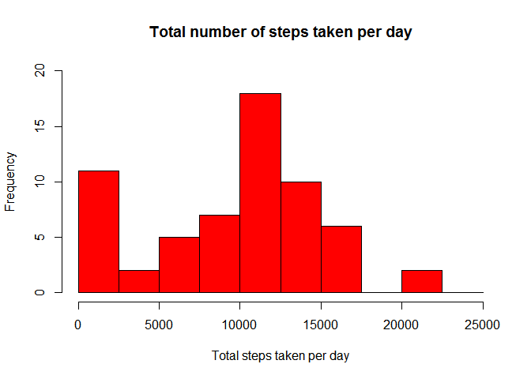
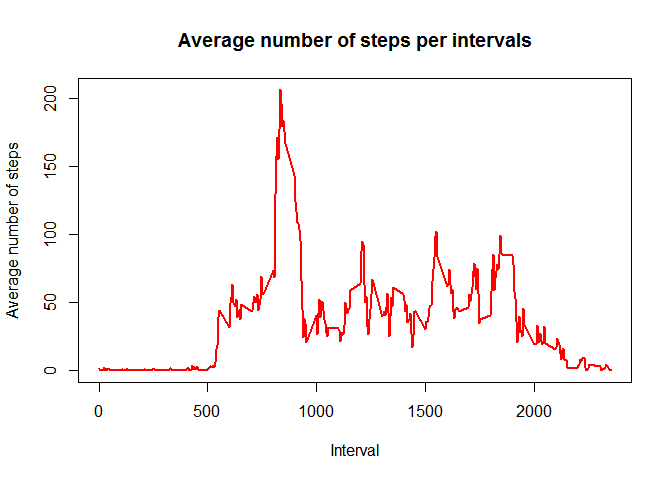
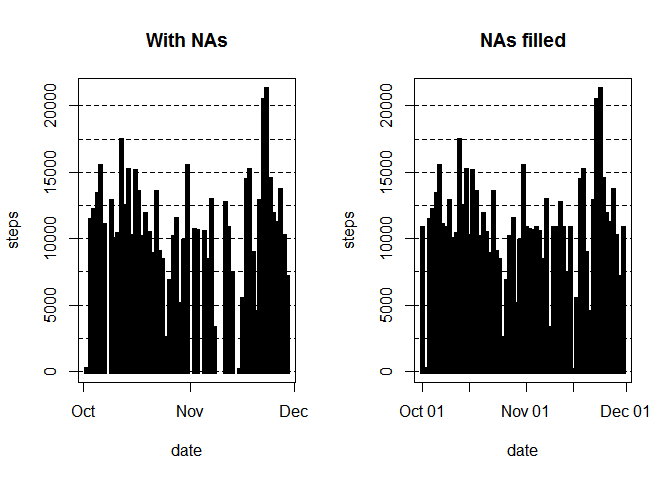
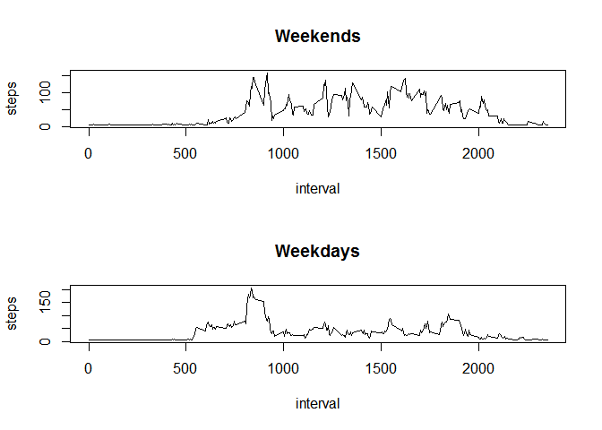

Step 1
------

Loading and preprocessing the data
----------------------------------

    activity<-read.csv("activity.csv")

Exploring the basics of this data

    #total number of missing data
    sum(is.na(activity$steps))

    ## [1] 2304

    activity$date <- as.POSIXct(activity$date, "%Y-%m-%d")

    ## Warning in strptime(xx, f, tz = tz): unknown timezone '%Y-%m-%d'

    ## Warning in as.POSIXct.POSIXlt(x): unknown timezone '%Y-%m-%d'

    ## Warning in strptime(xx, f, tz = tz): unknown timezone '%Y-%m-%d'

    ## Warning in as.POSIXct.POSIXlt(x): unknown timezone '%Y-%m-%d'

    ## Warning in strptime(xx, f, tz = tz): unknown timezone '%Y-%m-%d'

    ## Warning in as.POSIXct.POSIXlt(x): unknown timezone '%Y-%m-%d'

    ## Warning in strptime(xx, f, tz = tz): unknown timezone '%Y-%m-%d'

    ## Warning in as.POSIXct.POSIXlt(x): unknown timezone '%Y-%m-%d'

    ## Warning in strptime(xx, f, tz = tz): unknown timezone '%Y-%m-%d'

    ## Warning in as.POSIXct.POSIXlt(x): unknown timezone '%Y-%m-%d'

    ## Warning in strptime(x, f, tz = tz): unknown timezone '%Y-%m-%d'

    ## Warning in as.POSIXct.POSIXlt(as.POSIXlt(x, tz, ...), tz, ...): unknown
    ## timezone '%Y-%m-%d'

    weekday <- weekdays(activity$date)

    ## Warning in as.POSIXlt.POSIXct(x, tz): unknown timezone '%Y-%m-%d'

    activity <- cbind(activity,weekday)
    dim(activity)

    ## [1] 17568     4

    names(activity)

    ## [1] "steps"    "date"     "interval" "weekday"

    head(activity)

    ## Warning in as.POSIXlt.POSIXct(x, tz): unknown timezone '%Y-%m-%d'

    ##   steps       date interval weekday
    ## 1    NA 2012-10-01        0  Monday
    ## 2    NA 2012-10-01        5  Monday
    ## 3    NA 2012-10-01       10  Monday
    ## 4    NA 2012-10-01       15  Monday
    ## 5    NA 2012-10-01       20  Monday
    ## 6    NA 2012-10-01       25  Monday

    str(activity)

    ## 'data.frame':    17568 obs. of  4 variables:
    ##  $ steps   : int  NA NA NA NA NA NA NA NA NA NA ...
    ##  $ date    : POSIXct, format:

    ## Warning in as.POSIXlt.POSIXct(x, tz): unknown timezone '%Y-%m-%d'

    ## "2012-10-01" "2012-10-01" ...
    ##  $ interval: int  0 5 10 15 20 25 30 35 40 45 ...
    ##  $ weekday : Factor w/ 7 levels "Friday","Monday",..: 2 2 2 2 2 2 2 2 2 2 ...

Step 2
------

What is mean total number of steps taken per day?
-------------------------------------------------

    total_steps <- with(activity, aggregate(steps, by = list(date), 
                                                     FUN = sum, na.rm = TRUE))

    ## Warning in as.POSIXlt.POSIXct(x, tz): unknown timezone '%Y-%m-%d'

    ## Warning in as.POSIXlt.POSIXct(x, tz): unknown timezone '%Y-%m-%d'

    names(total_steps) <- c("date", "steps")

    hist(total_steps$steps, main = "Total number of steps taken per day", xlab = "Total steps taken per day", col = "red", ylim = c(0,20), breaks = seq(0,25000, by=2500))

    mean(total_steps$steps)

    ## [1] 9354.23

    median(total_steps$steps)

    ## [1] 10395

Step 3
------

What is the average daily activity pattern?
-------------------------------------------

    average_act <- aggregate(activity$steps, by=list(activity$interval), FUN=mean, na.rm=TRUE)
    names(average_act) <- c("interval", "mean")

    plot(average_act$interval, average_act$mean, type = "l", col="red", lwd = 2, xlab="Interval", ylab="Average number of steps", main="Average number of steps per intervals")

    #Which 5-minute interval, on average across all the days in the dataset, #contains the maximum number of steps?

    average_act[which.max(average_act$mean), ]$interval

    ## [1] 835

Step 4
------

Imputing missing values
-----------------------

    activity2 <- activity
    sapply(activity2, class)

    ## $steps
    ## [1] "integer"
    ## 
    ## $date
    ## [1] "POSIXct" "POSIXt" 
    ## 
    ## $interval
    ## [1] "integer"
    ## 
    ## $weekday
    ## [1] "factor"

    activity2$steps[is.na(activity2$steps)] <- mean(na.omit(activity$steps))
    activity2$date <- as.Date(activity2$date, format = "%Y-%m-%d")
    steps_day <- aggregate(steps ~ date, rm.na = TRUE, data = activity, FUN = sum)

    ## Warning in as.POSIXlt.POSIXct(x, tz): unknown timezone '%Y-%m-%d'

    ## Warning in as.POSIXlt.POSIXct(x, tz): unknown timezone '%Y-%m-%d'

    steps_day2 <- aggregate(steps ~ date, rm.na = TRUE, data = activity2, FUN = sum)

    par(mfrow = c(1, 2))
    plot(steps_day, type = "h", lwd = 5,lend = "square", main = "With NAs")

    ## Warning in as.POSIXlt.POSIXct(z): unknown timezone '%Y-%m-%d'

    ## Warning in as.POSIXct.POSIXlt(zz): unknown timezone '%Y-%m-%d'

    ## Warning in as.POSIXlt.POSIXct(x, tz): unknown timezone '%Y-%m-%d'

    abline(h = seq(0, 20000, 2500), lty = "dashed")
    plot(steps_day2, type = "h", lwd = 5, lend = "square", main = "NAs filled")
    abline(h = seq(0, 20000, 2500), lty = "dashed")

Step 5
------

Are there differences in activity patterns between weekdays and weekends?
-------------------------------------------------------------------------

    activity2$weekday <- factor(format(activity2$date, "%A"))

    levels(activity2$weekday) <- list(weekday = c("Monday", "Tuesday",
                                                  "Wednesday", "Thursday",
                                                  "Friday"), weekend =
                                              c("Saturday", "Sunday"))
    par(mfrow = c(2, 1))

    with(activity2[activity2$weekday == "weekend",], plot(aggregate(steps ~ interval, FUN = mean), type = "l", main = "Weekends"))

    with(activity2[activity2$weekday == "weekday",], plot(aggregate(steps ~ interval, FUN = mean), type = "l", main = "Weekdays"))

